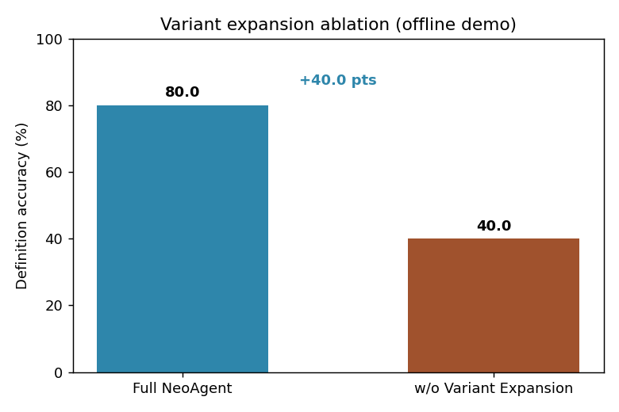
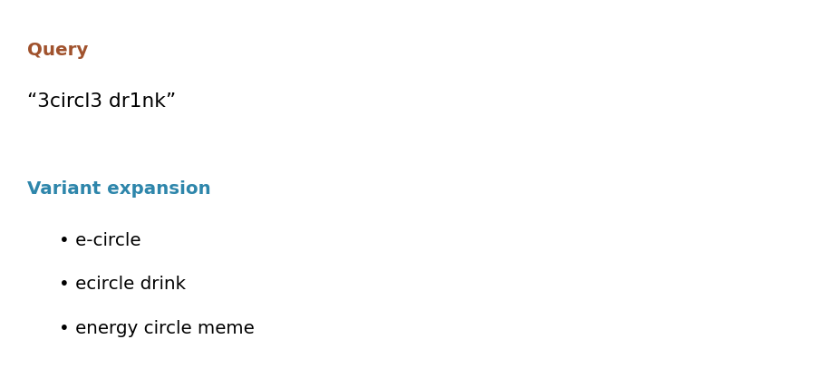

# NeoAgent

A lightweight, dependency-minimal reference implementation of **variant-aware
retrieval-augmented question answering**. NeoAgent targets the *lexical-novelty*
regime: settings where the same concept surfaces as an abbreviation, a typo, a
homophonic rewrite, leetspeak, or a community-specific paraphrase, so that a
literal query fails to retrieve the evidence before reasoning even begins.

The central idea is **lexical-regime alignment**: the lexical distribution under
which an agent is trained should match the one it meets at inference. NeoAgent
instantiates this with three coupled mechanisms — a neologism evolution forest, a
variant-constrained data-synthesis pipeline, and a variant-expansion search tool —
all of which run here offline with only the Python standard library plus
`matplotlib` for plotting.

## Why this exists

Most retrieval-augmented QA systems are trained on questions drawn from canonical
surface forms, then deployed against noisy, drifting real-world text. The mismatch
sits at the lexical layer rather than the semantic one. NeoAgent closes the gap by
synthesizing training questions whose surface forms are deliberately corrupted, and
by equipping the agent with a retrieval tool that expands a noisy query into
plausible alternative forms on the fly.

## Repository layout

```
neoagent/
├── neoagent/                  # the package
│   ├── evolution_tree.py      # neologism evolution forest (Eq. 1)
│   ├── synthesis.py           # variant-constrained synthesis + greedy clue selection (Eq. 2-4, Alg. 1)
│   ├── search_tool.py         # variant-aware SEARCH / BROWSE over an offline corpus (Eq. 5)
│   ├── variants.py            # query variant expansion (rule-based stand-in for a learned model)
│   ├── bm25.py                # pure-Python Okapi BM25
│   └── agent.py               # ReAct-style search--reason loop
├── data/
│   ├── seed_neologisms.json   # seed set of neologisms with attributes and variants
│   └── web_corpus.json        # small synthetic corpus the search tool retrieves against
├── scripts/
│   ├── synthesize.py          # generate variant-constrained QA instances
│   └── evaluate.py            # evaluate + run the variant-expansion ablation, save figures
├── tests/
│   └── test_core.py           # unit + smoke tests
├── assets/                    # figures used in this README
└── run_demo.py                # end-to-end entry point
```

## Installation

No GPU, API key, or internet access is required.

```bash
git clone <your-fork-url>
cd neoagent
pip install -r requirements.txt        # only matplotlib
```

Optionally install the package itself for `import neoagent` from anywhere:

```bash
pip install -e .
```

## Usage

Run the full pipeline end to end:

```bash
python run_demo.py
```

Generate a fresh set of variant-constrained QA instances:

```bash
python scripts/synthesize.py
```

Evaluate the agent and reproduce the figures below:

```bash
python scripts/evaluate.py
```

Run the tests:

```bash
python tests/test_core.py        # stdlib runner
# or, if pytest is installed:
python -m pytest tests/
```

## How it works

1. **Evolution forest** (`evolution_tree.py`). Seed neologisms are linked into trees
   whose edges encode semantic drift, so that evidence about one concept is
   distributed across lexically distinct but semantically adjacent neighbours.

2. **Variant-constrained synthesis** (`synthesis.py`). Each node's attributes pass
   through three transformations — variant obfuscation, numeric/date fuzzification,
   and semantic rephrasing. A greedy solver then selects a compact clue set that is
   maximally discriminative while keeping any known variant *unrecoverable* by a
   single-shot lexical lookup (the lexical-opacity constraint).

3. **Variant-aware retrieval** (`search_tool.py`, `variants.py`). At query time the
   tool expands a noisy surface form into a small set of high-confidence
   alternatives, retrieves jointly over all of them with BM25, then filters and
   summarizes the evidence. This is the component that lets the agent recover a page
   indexed under a canonical spelling from an obfuscated query.

4. **Search–reason loop** (`agent.py`). The agent extracts the obfuscated alias,
   issues an expanded search, aggregates score-weighted evidence across hops, and
   scores candidate concepts against the recovered text.

## Results

The bundled evaluation synthesizes definition-type questions whose target concept is
hidden behind an obfuscated (leetspeak) alias, then compares the full agent against a
configuration with variant expansion disabled. The gap is produced by the mechanism,
not by hand-tuned numbers: without expansion, an obfuscated alias such as
`r1zzed up` does not lexically match the canonical evidence page.



A representative expansion: an obfuscated query is mapped back to plausible canonical
surface forms before retrieval.



> The numbers above come from the small synthetic corpus shipped in `data/` and are
> intended to illustrate the mechanism on a self-contained example. They are not the
> large-scale benchmark scores; swap in your own seed set and corpus to scale up.

## Extending to a real setup

The reference components are written against narrow interfaces so they can be
replaced piece by piece:

- **Learned variant expansion** — replace `VariantExpander.expand(query) -> list[str]`
  with a fine-tuned character-level model while keeping the same contract.
- **Dense retrieval / reranking** — the semantic-filtering stage in `search_tool.py`
  uses token overlap as a stand-in; substitute sentence embeddings and a
  cross-encoder reranker.
- **A trained policy** — replace `NeoAgent.answer` with calls to a fine-tuned model
  that consumes the same `SearchTool`.
- **Live web search** — point `SearchTool` at a real search backend instead of the
  offline corpus.
- **LLM-based synthesis** — swap the deterministic `f_llm` paraphraser in
  `synthesis.py` for an LLM call honouring the same signature.

## License

Released under the MIT License. See [LICENSE](LICENSE).
